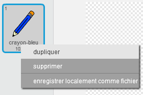
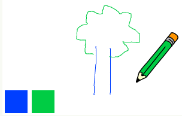

## Stylos colorés

Ajoutons des stylos de différentes couleurs à votre projet et permettons à l'utilisateur de choisir entre ceux-ci!

+  Cliquez sur votre lutin de crayon, cliquez sur l'onglet 'Costumes' et dupliquez votre 'costume' de crayon bleu.

	

+ Renommez votre nouveau costume ' crayon vert ' et colorez le crayon en vert.

	

+ Créez deux nouveaux lutins que vous utiliserez pour sélectionner le crayon bleu ou vert.

	

+ Quand l'icône de sélecteur verte est cliquée, vous devrez `envoyer à tous`{:class="blockevents"} un message au lutin de crayon en lui disant de changer son costume et la couleur du crayon.

	Pour faire cela, ajoutez ce code à l'icône de sélecteur verte:

	```blocks
		quand ce lutin est cliqué
		envoyer à tous [green v]
	```

	Afin de créer le bloc `envoyer à tous`{:class="blockevents"}, cliquez sur la flèche du bas et séléctionnez ' nouveau message ... '.

	

	Vous pouvez alors taper 'vert' pour créer votre nouveau message.

	

+ Vous devez maintenant dire à votre lutin de crayon quoi faire lorsqu'il reçoit le message. Ajoutez ce code à votre lutin de crayon:

	```blocks
		quand je reçois [green v]
		basculer sur costume [pencil-green v]
		mettre la couleur du stylo à [#00ff00]
	```

	Pour faire colorier le crayon en vert, cliquez sur la boîte colorée dans le bloc `choisir la couleur`{:class="blockpen"}, cliquez sur l'icône de sélecteur verte pour choisir vert comme couleur de crayon.

+ Vous pouvez maintenant faire la même chose pour l'icône du crayon bleu en ajoutant ce code au lutin de sélecteur bleu:

	```blocks
		quand ce lutin est cliqué
		envoyer à tous [blue v]
	```

	...Et ajoutant ce code au lutin de crayons :

	```blocks
		quand je reçois [blue v]
		basculer sur costume [pencil-blue v]
		mettre la couleur du stylo à [#0000ff]
	```

+ Quand votre projet est commencé, ajoutez ce code au début du crayon `Quand le drapeau pressé`{:class="blockevents"} (avant la boucle `répéter indéfiniment`{:class="blockcontrol"}):

	```blocks
		effacer tout
		basculer sur costume [blue-pencil v]
		mettre la couleur du stylo à [#0000ff]
	```

	Si vous préférez, vous pouvez commencer par un crayon de couleur différente!

+ Testez votre projet. Pouvez-vous changer entre des stylos bleus et verts ?

	


