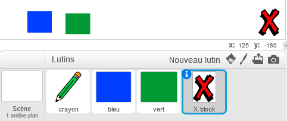
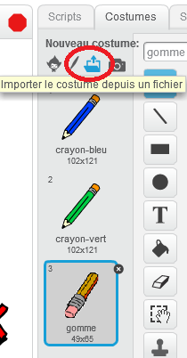
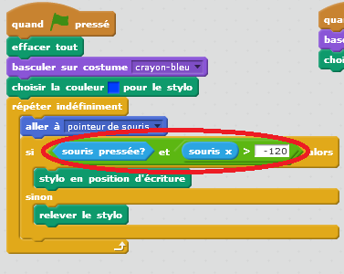

## Erreurs de fabrication

Parfois, les erreurs arrivent. Ajoutons le boutton 'Nettoyer' et une gomme à effacer à notre projet!

+ Ajoutons un bouton pour annuler l'étape. Pour faire cela, ajoutez le lutin 'X-block' à l'étape et coloriez-le en rouge.

	

+ Ajoutez ce code à votre nouveau bouton pour annuler l'étape lorsqu'il est cliqué.

	```blocks
		quand ce lutin est cliqué
		effacer tout
	```

	Remarquez que vous ne devez pas envoyer un message pour approuver l'étape comme pour n'importe quel lutin!

+ Vous pouvez aussi créer une gomme à effacer. Si votre leader de club vous a donné une 'Ressource', cliquez 'importer le lutin depuis un fichier' et ajoutez l'image.

	

	Si vous n'avez pas l'image de gomme, vous devez simplement créer un nouveau stylo blanc!

	+ Vous devriez aussi ajouter l'image de la gomme comme nouveau lutin de séléction. Votre étape sera comme suit :

	

+ Vous pouvez alors ajouter le code à ce lutin de séléction de gomme et dire au crayon de se changer en gomme.

	```blocks
		quand ce lutin est cliqué
		envoyer à tous  [eraser v]
	```

+ Quand le crayon reçoit ce message, vous pouvez créer une gomme à effacer en changeant le costume de crayon à la gomme et en changeant la couleur de crayon à la même couleur que l'étape (blanc)!

	```blocks
		quand je reçois [eraser v]
		basculer sur costume [eraser v]
		mettre la couleur du stylo à [#FFFFFF]
	```

+ Testez votre projet, regardez si vous pouvez annuler et effacer sur l'étape.

	

+ Il y a encore un problème avec le crayon - vous pouvez dessiner n'importe où sur l'étape, y compris près des icônes de séléction!

	

	Pour cela, vous devez dire au crayon de dessiner seulement si la souris est cliquée et si la position 'y' de la souris est plus grande que -110 (`souris y`{:class="blocksensing"}`> -120`{:class="blockoperators"}). Changez votre crayon `si`{:class="blockcontrol"} la déclaration est comme celle-ci :

	

+ Testez votre projet. Maintenant, vous ne devriez pas pouvoir vous approcher des blocs de séléction.

	


